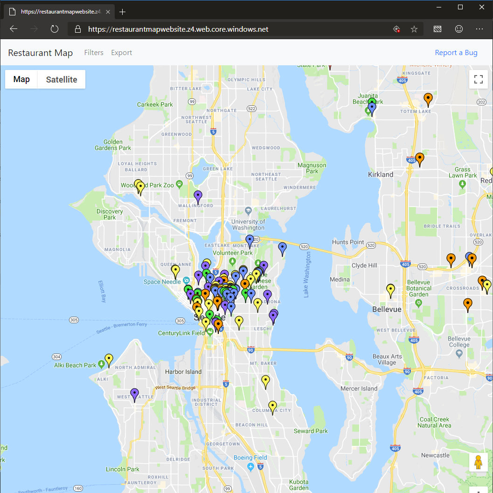
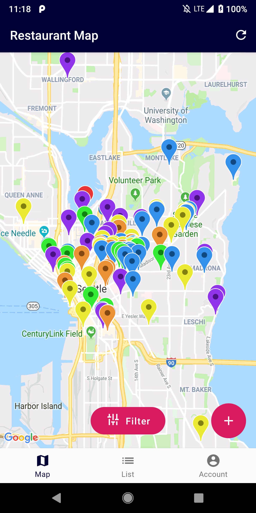

# Restaurant Map #

Restaurant Map is a full stack application that I use to track what restaurants I have visited and how much I liked them.

## Restaurant Map Website ##

The website was the first front end I made for this application. Orginally you could use it to add and delete restaurants. But since the introduction of the Android app, the website is simply meant to be a viewing portal. Full support for CRUD operations has been delegated to the Android app.

## Restaurant Map Android (WIP) ##

The Android app is the current focus of development. The app is intended to support all CRUD operations.

## Restaurant Map API ##

The API powering Restaurant Map is an ASP .NET Core Web App running in Azure.

## Contributing ##

Feel free to contribute to this repo. For best results, comment on issues you are interested in so we can discuss it further before you start working. See the [Getting Started](/GettingStarted.md) guide for more details.
